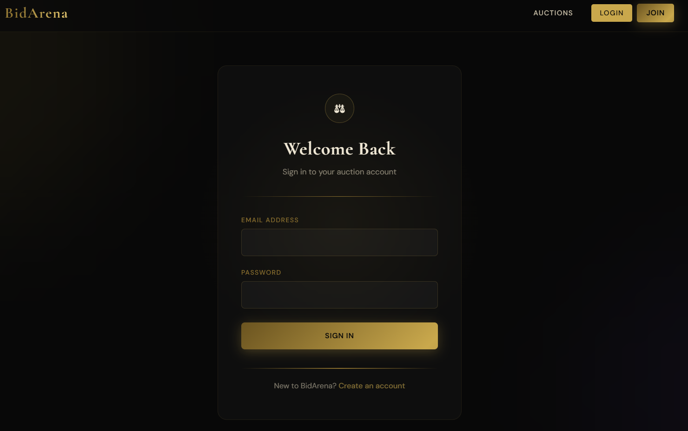
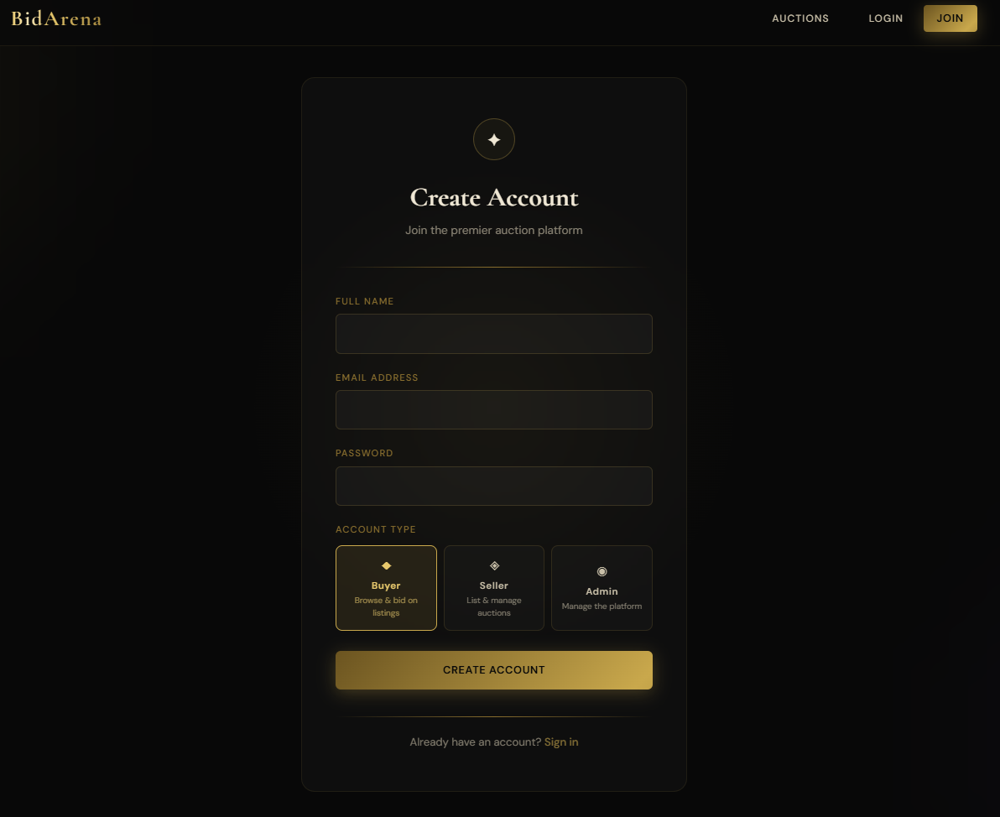

# 🏷️ BID ARENA

BID ARENA is a full-stack real-time online auction platform designed to provide a seamless and interactive bidding experience. Users can securely register, browse active auctions, place bids in real time, and monitor auction progress through instant live updates powered by Socket.io.

The platform includes secure JWT-based authentication, auction creation and management, an administrative dashboard, automated auction scheduling, winner determination, and transaction tracking. Built using a modern React frontend and a Node.js/Express backend, the project demonstrates practical implementation of real-time communication, RESTful APIs, authentication, and full-stack application development.

**Built using:** React • Node.js • Express.js • MongoDB • Socket.io • JWT

---

## ✨ Features

- 🔐 Secure JWT Authentication
- ⚡ Real-time bidding using Socket.io
- 🏆 Automatic winner selection after auction completion
- ⏳ Live countdown timer for auctions
- 📊 Admin dashboard for auction management
- 💰 Bid history & transaction tracking
- 📱 Responsive and modern user interface

---

## 📸 Screenshots

### 🏠 Home


### 🔑 Login



### 👤 Register



---

## 🛠️ Tech Stack

| Category | Technologies |
|----------|--------------|
| Frontend | React 18, Vite, Tailwind CSS |
| Backend | Node.js, Express.js |
| Database | MongoDB, Mongoose |
| Authentication | JWT |
| Real-time Communication | Socket.io |

---

# 🚀 Getting Started

## Prerequisites

- Node.js (v18 or above)
- npm
- MongoDB (Optional if using the in-memory database)

---

## Clone the Repository

```bash
git clone https://github.com/aadith-v/BID-ARENA-.git
cd BID-ARENA-
```

---

## Installation

### Backend

```bash
cd backend
npm install
```

### Frontend

```bash
cd Frontend
npm install
```

---

## Environment Variables

### Backend (`backend/.env`)

```env
PORT=5000
MONGO_URI=mongodb://localhost:27017/auction
JWT_SECRET=your_secret_key
JWT_EXPIRES_IN=7d
CORS_ORIGIN=*
```

### Frontend (`Frontend/.env`)

```env
VITE_API_URL=http://localhost:5000
```

---

# ▶️ Running the Application

### Backend

Using Local MongoDB

```bash
cd backend
npm run dev
```

Using In-Memory MongoDB

```bash
cd backend
npm run dev:local
```

---

### Frontend

```bash
cd Frontend
npm run dev
```

Visit:

```
http://localhost:3000
```

---

# 📂 Project Structure

```text
BID-ARENA/
│
├── Frontend/
│   ├── src/
│   │   ├── components/
│   │   ├── context/
│   │   ├── lib/
│   │   ├── pages/
│   │   ├── App.jsx
│   │   └── main.jsx
│   ├── public/
│   ├── vite.config.js
│   └── package.json
│
├── backend/
│   ├── src/
│   │   ├── config/
│   │   ├── controllers/
│   │   ├── middlewares/
│   │   ├── models/
│   │   ├── routes/
│   │   ├── sockets/
│   │   ├── utils/
│   │   ├── app.js
│   │   ├── server.js
│   │   └── dev-server.js
│   └── package.json
│
├── screenshots/
│
├── README.md
├── DEPLOYMENT.md
└── package.json
```

---

# 🌐 REST API

## Authentication

| Method | Endpoint |
|---------|----------|
| POST | `/api/auth/register` |
| POST | `/api/auth/login` |
| GET | `/api/auth/profile` |

---

## Auctions

| Method | Endpoint |
|---------|----------|
| GET | `/api/auctions` |
| GET | `/api/auctions/:id` |
| POST | `/api/auctions` |
| PUT | `/api/auctions/:id` |
| DELETE | `/api/auctions/:id` |

---

## Bids

| Method | Endpoint |
|---------|----------|
| POST | `/api/bids` |
| GET | `/api/bids/:auctionId` |

---

## Admin

| Method | Endpoint |
|---------|----------|
| GET | `/api/admin/stats` |
| GET | `/api/admin/users` |

---

# 🔌 WebSocket Events

### Client → Server

- `join_auction`
- `place_bid`

### Server → Client

- `bid_placed`
- `auction_ended`
- `user_connected`

---

# 📦 Available Scripts

## Backend

```bash
npm run dev
```

Runs the backend using a local MongoDB instance.

```bash
npm run dev:local
```

Runs the backend with an in-memory MongoDB server.

```bash
npm start
```

Starts the production server.

---

## Frontend

```bash
npm run dev
```

Starts the Vite development server.

```bash
npm run build
```

Builds the application for production.

```bash
npm run preview
```

Previews the production build locally.

---

# 🚀 Deployment

### Frontend

Deploy using:

- Vercel
- Netlify

### Backend

Deploy using:

- Render
- Railway

---

# 🔮 Future Enhancements

- 💳 Payment Gateway Integration
- ❤️ Watchlist / Wishlist
- 🔍 Advanced Search & Filters
- 📧 Email Notifications
- 🖼️ Auction Image Uploads
- ⭐ User Profiles & Ratings
- 📈 Auction Analytics Dashboard

---

# 🤝 Contributing

Contributions are welcome!

If you'd like to improve the project, feel free to fork the repository, create a new branch, and submit a pull request.

---

# 📄 License

This project is licensed under the **MIT License**.

---